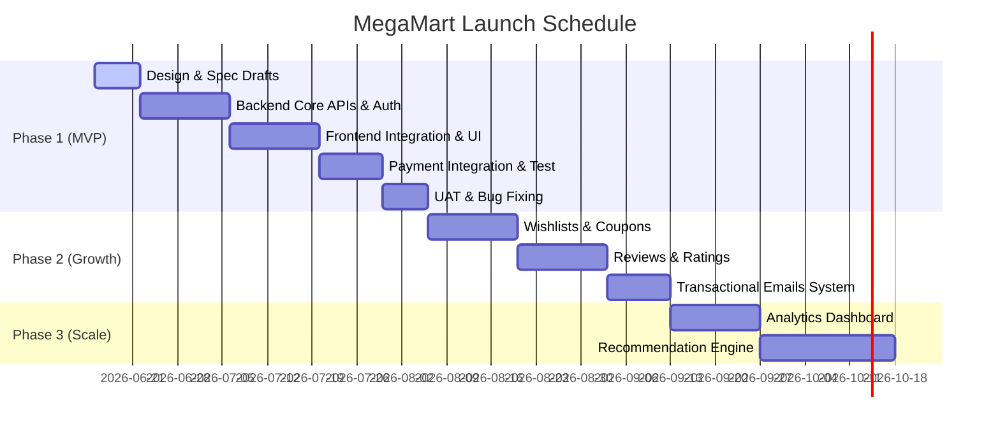

# Product Requirements Document (PRD): MegaMart

---

## 1. Executive Summary

### 1.1 Product Vision & Mission Statement
**Vision:** To build India's most trusted, hyper-local, and seamless e-commerce marketplace, connecting millions of urban consumers with high-quality daily essentials, electronics, and fashion within record delivery times.

**Mission:** MegaMart empowers urban consumers by delivering quality products on demand through a secure, blazing-fast, and intuitive platform while supporting local merchants, brands, and ecosystems.

### 1.2 Problem Statement
Urban Indian shoppers face a highly fragmented retail ecosystem. Traditional local grocery and convenience stores ("kiranas") lack online catalogs, digital inventory visibility, and quick home-delivery mechanisms. Conversely, existing major e-commerce platforms often suffer from delayed deliveries (2–5 days), complex checkout experiences, high shipping costs for low-value orders, and security issues in payments. MegaMart solves these issues by establishing a centralized, high-performance, and high-security hybrid marketplace that integrates local inventory hubs for express delivery alongside major distribution networks for larger items.

### 1.3 Market Size & Opportunity
The Indian e-commerce market is projected to reach $188 billion by 2025 and over $350 billion by 2030. Quick-commerce (Q-commerce) and hyperlocal grocery categories are growing at a CAGR of 150%, especially in Tier-1 and Tier-2 metropolitan areas. By targeting convenience-driven urban buyers (who prioritize speed, authenticity, and checkout simplicity), MegaMart captures a large slice of this expanding digital retail market.

---

## 2. Business Goals (SMART)

To ensure commercial viability and guide engineering priorities, the platform targets the following metrics:

| Metric | Target (Month 6) | Target (Month 12) | Target (Month 24) |
| :--- | :--- | :--- | :--- |
| **Gross Merchandise Value (GMV)** | ₹1.2 Crore ($150k USD) / Mo | ₹5 Crore ($600k USD) / Mo | ₹20 Crore ($2.5M USD) / Mo |
| **Customer Acquisition** | 25,000 registered users | 100,000 registered users | 500,000 registered users |
| **Conversion Rate (Cart → Purchase)**| 3.2% | 4.5% | 5.5% |
| **Average Order Value (AOV)** | ₹850 | ₹1,200 | ₹1,600 |
| **Customer Retention (30-day)** | 35% | 48% | 55% |

---

## 3. Target Users & Personas

MegaMart serves three distinct user cohorts:

### 3.1 Primary Persona: Rohan Malhotra — The Busy Urban Professional
* **Demographics:** Age 28, Single, Lives in Bangalore, Software Developer.
* **Tech-Savviness:** Extremely high. Uses iOS, MacBook, and multiple smart home devices.
* **Device Usage:** 90% mobile (iOS), 10% desktop (web).
* **Purchase Frequency:** 3–4 times per week (groceries, snacks, quick electronics).
* **Pain Points:** 
  * Long working hours leave no time for retail shopping.
  * Annoyed by slow load times and multiple redirects during checkout.
  * Suffers from cart abandonment when favorite local payment options (UPI/GPay) fail.
* **Empathy Map:**
  * *Says:* "I want quality items delivered immediately without having to call or check up on the driver."
  * *Thinks:* "Why is it so hard to buy milk, bread, and a charger cable in under 5 minutes online?"
  * *Does:* Regularly cancels orders if the mobile interface glitches or has low contrast.
  * *Feels:* Anxious about credit card security; prefers quick UPI or secure tokenized card checkouts.

### 3.2 Secondary Persona: Kavita Sharma — The Retail Partner / Store Admin
* **Demographics:** Age 42, Married, Lives in Mumbai, Owner of "Sharma Kirana & General Store".
* **Tech-Savviness:** Moderate. Comfortable with Android WhatsApp, UPI apps, and basic web portals.
* **Device Usage:** 100% Android Mobile & Tablet.
* **Purchase Frequency:** Daily inventory checkouts and product listings.
* **Pain Points:** 
  * Difficulty tracking daily store sales, earnings, and fast-moving inventory.
  * Hard-to-use admin panels that require desktop access.
  * Delayed payouts from traditional e-commerce vendors.
* **Empathy Map:**
  * *Says:* "I need a simple screen to change my prices and see what orders I need to pack."
  * *Thinks:* "If this app is too complicated, my staff won't use it, and we will miss deliveries."
  * *Does:* Packs orders on tables, prints receipts via Bluetooth printers, updates stock levels directly from mobile.
  * *Feels:* Excited about expanding her reach but worried about technology overhead.

### 3.3 Tertiary Persona: Guest/Anonymous Browser
* **Demographics:** Age 55, Retired, Lives in Pune, Browsing for products recommended by children.
* **Tech-Savviness:** Low. Hesitant to share personal information before seeing final prices.
* **Device Usage:** Desktop or large-screen Android phones.
* **Purchase Frequency:** Occasional (1–2 times a month).
* **Pain Points:**
  * Mandatory signup/login walls before viewing products or shipping costs.
  * Complex search menus.
* **Empathy Map:**
  * *Says:* "I just want to see if they have the product and what it costs with shipping."
  * *Thinks:* "Why must I type my email and password just to look at a list of items?"
  * *Does:* Leaves websites that enforce popups or immediately require email verification.
  * *Feels:* Skeptical about digital data privacy.

---

## 4. Feature Prioritization Matrix

We categorize features using the MoSCoW prioritization model:

### P0 — Must Have (Launch Blockers)
1. **User Authentication & Authorization:** Secure JWT signup/login, forgot/reset password via email, verified accounts, separate Customer and Admin dashboards.
2. **Dynamic Product Catalog:** Categorized browse page, robust fuzzy text search, multi-attribute filtering (price, category, rating).
3. **Product Detail Page (PDP):** Multiple images zoom, variant picker (color/size), real-time stock levels, rating display.
4. **Interactive Shopping Cart:** Persistent cart across sessions, quantity increments, tax/shipping calculations.
5. **Two-Step Checkout Flow:** Saved shipping address selection, billing summary, Razorpay/Stripe checkout overlays.
6. **Admin Management Panel:** Comprehensive CRUD for products/categories, inventory management tracker, order dispatch statuses.
7. **Mobile-First Responsive Layout:** 100% responsive fluid grid fitting screens from 320px to 2560px width.

### P1 — Should Have (Post-Launch Sprint 1)
1. **Wishlist Management:** Add/remove items to private list, move to cart.
2. **Product Reviews & Ratings:** Verified purchase reviews submission with star ratings (1–5).
3. **Transactional Emails:** Triggered confirmations via Resend/SendGrid for order placement, shipment status, and billing.
4. **Discount Engine:** Validation and application of promotional coupon codes (percentage and flat discounts).
5. **Search Autocomplete:** Instant drop-down search suggestions as user types.

### P2 — Nice to Have (Roadmap)
1. **Product Recommendation System:** "Frequently Bought Together" carousel on cart/checkout pages.
2. **Loyalty Points System:** Cash-back points on purchases.
3. **Multi-Vendor Engine:** Onboarding flow for independent retailers to list their items directly.
4. **Analytics Dashboard:** Graphical sales charts (daily, monthly GMV, conversion funnel drops).

---

## 5. User Stories

### Authentication & Profiles
* **US-01:** As a *new visitor*, I want to create an account with my email, password, and name, so that I can track my orders and save my checkout details. (Maps to: Customer Acquisition)
* **US-02:** As a *customer*, I want to log in using secure credentials and receive a token so that my session remains active for subsequent visits. (Maps to: Customer Acquisition)
* **US-03:** As a *customer*, I want to reset my password using a secure link sent to my email if I forget it. (Maps to: Security)
* **US-04:** As a *customer*, I want to see my profile details and update my contact phone number and name. (Maps to: Retention)
* **US-05:** As a *customer*, I want to add, edit, and delete multiple shipping addresses in my dashboard so I can select them during checkout. (Maps to: Conversion Rate)

### Product Discovery & Browsing
* **US-06:** As a *visitor*, I want to browse products by hierarchical categories (e.g., Electronics → Smartphones) to find what I need quickly. (Maps to: Conversion Rate)
* **US-07:** As a *visitor*, I want to search for products using a search bar that supports fuzzy spelling matching so I find items even with minor typos. (Maps to: Conversion Rate)
* **US-08:** As a *visitor*, I want to filter products by price range, average rating, and availability to narrow down my selection. (Maps to: Conversion Rate)
* **US-09:** As a *visitor*, I want to sort search/category results by "Price: Low to High", "Price: High to Low", and "Newest Arrivals" to compare prices easily. (Maps to: Conversion Rate)
* **US-10:** As a *customer*, I want to view a detailed product page with multiple high-quality zoomable images, variant selectors, and product descriptions so I can verify its suitability. (Maps to: AOV)

### Shopping Cart
* **US-11:** As a *customer*, I want to add products directly from the home grid or product details page to my shopping cart. (Maps to: AOV)
* **US-12:** As a *customer*, I want to view my cart and see itemized costs, taxes, and shipping fees before checking out. (Maps to: Conversion Rate)
* **US-13:** As a *customer*, I want to increase or decrease item quantities in the cart, with immediate subtotal recalculations. (Maps to: AOV)
* **US-14:** As a *customer*, I want to remove items from my cart easily. (Maps to: Conversion Rate)
* **US-15:** As a *returning customer*, I want my cart contents to persist across my devices when logged in so I can resume shopping later. (Maps to: Retention)

### Checkout & Payments
* **US-16:** As a *customer*, I want to apply coupon codes in my cart to receive discounts. (Maps to: Conversion Rate)
* **US-17:** As a *customer*, I want to select a default shipping address and review my order items in a clean summary before initiating payment. (Maps to: Conversion Rate)
* **US-18:** As a *customer*, I want to pay securely using Razorpay UPI, Netbanking, or cards so that my payment is instantly processed. (Maps to: Security)
* **US-19:** As a *customer*, I want to see a clear order confirmation page with my invoice and order ID upon successful payment. (Maps to: Retention)
* **US-20:** As a *customer*, I want to view a transactional receipt in my inbox immediately after buying. (Maps to: Retention)

### Order Tracking
* **US-21:** As a *customer*, I want to check a list of my past orders in my dashboard with their current delivery status. (Maps to: Retention)
* **US-22:** As a *customer*, I want to cancel a "Pending" order directly from my panel if I change my mind before dispatch. (Maps to: CSAT)
* **US-23:** As a *customer*, I want to view a progress timeline (Placed → Confirmed → Shipped → Delivered) for my active orders. (Maps to: CSAT)

### Reviews & Ratings
* **US-24:** As a *verified buyer*, I want to submit a 1–5 star rating and written review on product pages to share my feedback. (Maps to: CSAT)
* **US-25:** As a *visitor*, I want to read product reviews left by other verified buyers to gauge quality before purchasing. (Maps to: Conversion Rate)

### Admin Operations
* **US-26:** As an *admin*, I want to log into a secure dashboard to monitor total sales, daily order counts, and registration metrics. (Maps to: Business Uptime)
* **US-27:** As an *admin*, I want to create new product listings, upload images, specify stock quantities, and assign categories. (Maps to: GMV)
* **US-28:** As an *admin*, I want to edit existing products or mark them as inactive to hide them from the storefront. (Maps to: GMV)
* **US-29:** As an *admin*, I want to view all user orders, change their status (e.g., Shipped, Delivered), and log tracking numbers. (Maps to: CSAT)
* **US-30:** As an *admin*, I want to create, modify, and delete promotional coupons with usage limits and expiry dates. (Maps to: AOV)

---

## 6. Acceptance Criteria (Gherkin Format)

### 6.1 Feature: User Authentication (Sign Up)
```gherkin
Scenario: Successful account registration with valid inputs
  Given the visitor is on the Registration Page
  When they enter a unique email "testuser@megamart.com", name "Test User", and password "P@ssword123"
  And click the "Sign Up" button
  Then the system should create a user record in the database
  And send an account verification email to "testuser@megamart.com"
  And display a success message: "Verification link sent to your email."

Scenario: Registration fails due to duplicate email
  Given the visitor is on the Registration Page
  When they input an email "existinguser@megamart.com" which is already registered
  And fill in remaining valid registration fields
  And click "Sign Up"
  Then the system should not create any user record
  And display an error: "This email is already associated with an account."
```

### 6.2 Feature: Shopping Cart Persistence
```gherkin
Scenario: Item additions remain in cart across user sessions
  Given a registered customer is logged in on a browser
  When they add a product "Samsung Galaxy S24" to their cart
  And close the browser session
  And open the browser again and log back in
  Then the shopping cart should still display "Samsung Galaxy S24" with quantity "1"
```

### 6.3 Feature: Razorpay Payment Integration
```gherkin
Scenario: Customer completes checkout successfully via Razorpay UPI
  Given the customer has items in the cart and is on the Checkout Page
  And has selected a valid shipping address
  When they click "Pay Now"
  Then the Razorpay SDK popup modal should load
  And when the customer enters valid UPI details and completes payment validation
  Then the system should capture the Razorpay transaction ID and signature
  And mark the Order status as "PAID"
  And redirect the customer to the Order Success Page displaying the Order ID
```

---

## 7. Success Metrics Dashboard

```
┌────────────────────────────────────────────────────────────────────────┐
│                        MEGAMART SUCCESS METRICS                        │
├───────────────────────────────┬────────────────────────────────────────┤
│ KPI                           │ Baseline / Target                      │
├───────────────────────────────┼────────────────────────────────────────┤
│ Page Load Time (LCP)          │ < 2.5 seconds (mobile 4G network)      │
│ Cart Abandonment Rate         │ Target: < 62% (current average 70%)    │
│ Checkout Completion Time      │ Target: < 90 seconds (avg start to end)│
│ API Response Time (P95)       │ Target: < 200ms                        │
│ Infrastructure Availability   │ SLA: 99.9% Uptime                      │
│ CSAT (Customer Satisfaction)  │ Target: > 4.5 / 5.0 (after-order poll) │
└───────────────────────────────┴────────────────────────────────────────┘
```

---

## 8. Out of Scope
* Native mobile applications (iOS/Android) built using React Native or Swift/Kotlin.
* Physical POS (Point-of-Sale) store terminal software or offline register synchronization.
* International multi-currency support (Phase 1 transactions are denominated exclusively in INR).
* Multilingual Localization (UI will support English only in MVP).

---

## 9. Risk Register

| Risk | Impact | Probability | Mitigation Strategy |
| :--- | :--- | :--- | :--- |
| **Payment Gateway Downtime** | Critical | Medium | Integrate Stripe as a secondary fallback. Enable webhooks to asynchronously retry failed status calls. |
| **Race Conditions in Stock** | Major | Low | Use PostgreSQL transaction locks (`SELECT FOR UPDATE`) inside Prisma when checking out to verify inventory. |
| **PII Data Breaches** | Critical | Low | Encrypt sensitive columns (addresses, phone numbers) at rest; never store credit card numbers (delegate to Stripe/Razorpay). |
| **Database Max Connections** | Major | Medium | Implement connection pooling using PgBouncer on database servers and Redis caching for product lists. |

---

## 10. Delivery Roadmap


